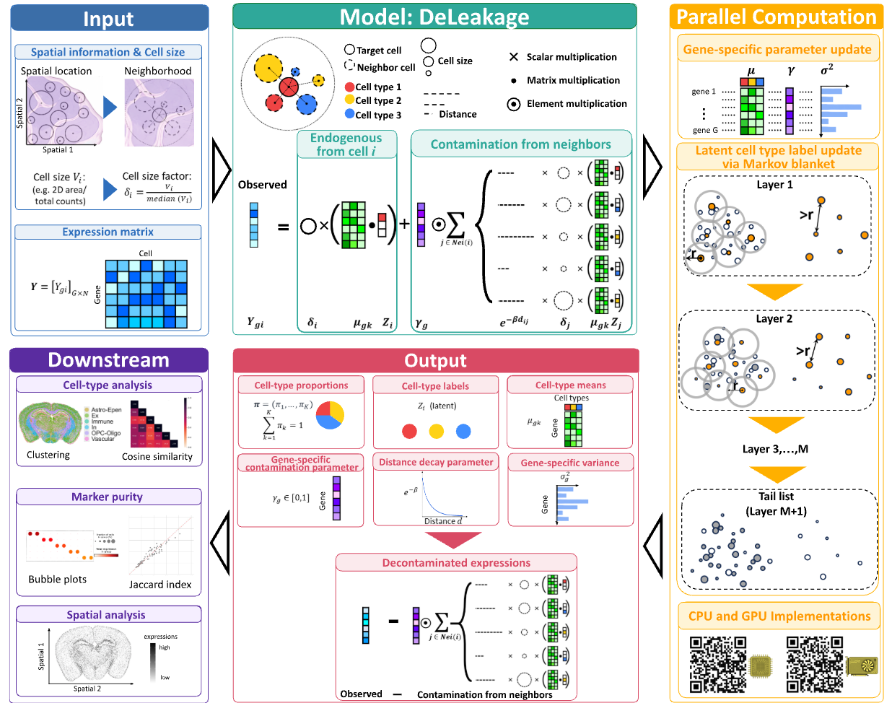

# **DeLeakage**
We are excited to release DeLeakage v1.0! To install, please follow the instructions in our [install page](install.md).

  

## **Overview**

To tackle the transcript leakage problem, we propose a Bayesian hierarchical model-based method, **DeLeakage** (**De**contamination for Transcript **Leakage**), which decomposes the observed transcript counts of each cell into its endogenous expression and transcripts leaked from other cells through a diffusion process Our model includes a different diffusion parameter for each gene, thus allowing the capture of gene-specific properties that affect leakage patterns.

## **License**

Copyright (c) 2026 DeLeakage authors

Permission is hereby granted, free of charge, to any person obtaining a copy of this software and associated documentation files (the “Software”), to deal in the Software without restriction, including without limitation the rights to use, copy, modify, merge, publish, distribute, sublicense, and/or sell copies of the Software, and to permit persons to whom the Software is furnished to do so, subject to the following conditions:

The above copyright notice and this permission notice shall be included in all copies or substantial portions of the Software.

THE SOFTWARE IS PROVIDED “AS IS”, WITHOUT WARRANTY OF ANY KIND, EXPRESS OR IMPLIED, INCLUDING BUT NOT LIMITED TO THE WARRANTIES OF MERCHANTABILITY, FITNESS FOR A PARTICULAR PURPOSE AND NONINFRINGEMENT. IN NO EVENT SHALL THE AUTHORS OR COPYRIGHT HOLDERS BE LIABLE FOR ANY CLAIM, DAMAGES OR OTHER LIABILITY, WHETHER IN AN ACTION OF CONTRACT, TORT OR OTHERWISE, ARISING FROM, OUT OF OR IN CONNECTION WITH THE SOFTWARE OR THE USE OR OTHER DEALINGS IN THE SOFTWARE.

