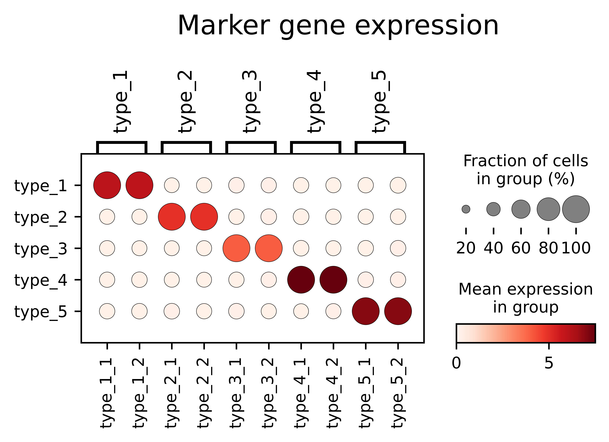
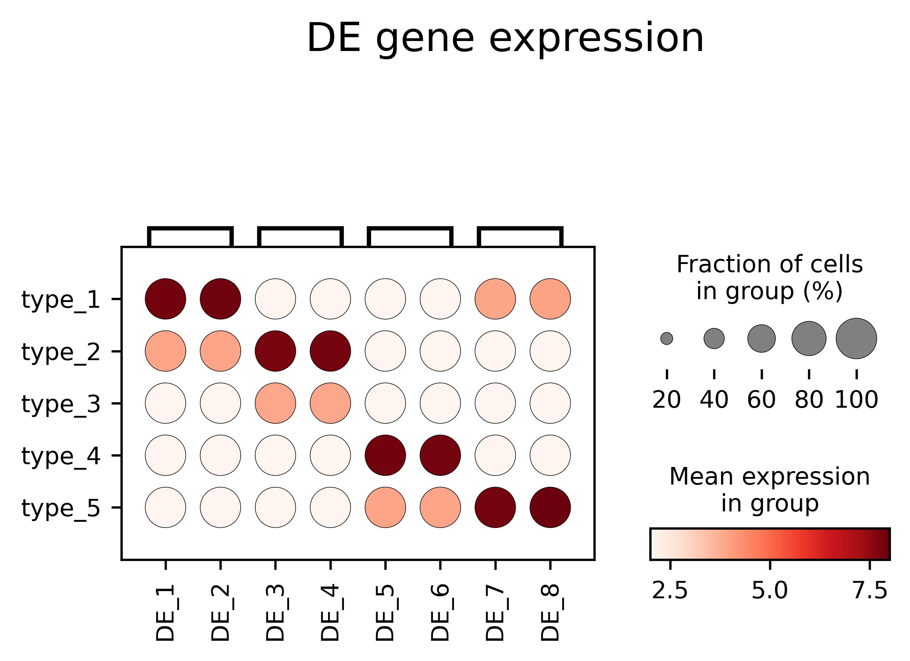
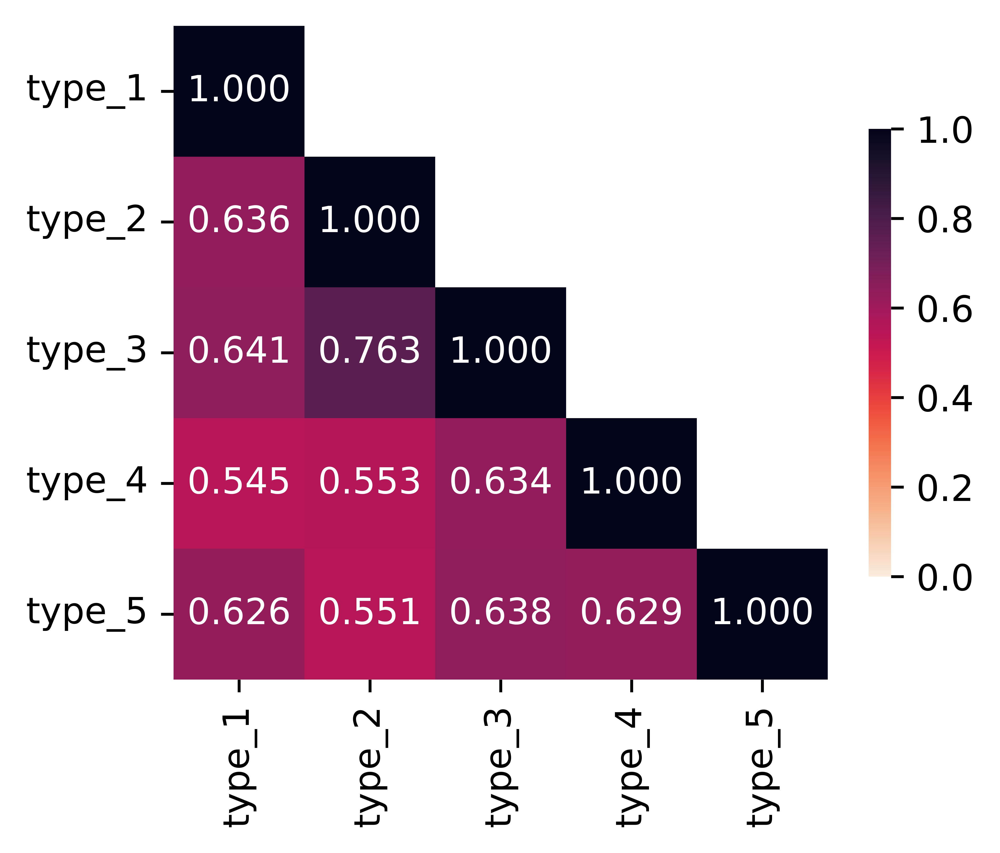

# <span style="color: black;">**Getting Started with DeLeakage**</span>
This full-step tutorial systematically covers **raw data preprocessing, DeLeakage model execution, multi-dimensional result visualization, and file specification**, following the core workflow of the DeLeakage decontamination framework: raw input collation → spatial neighbor construction → Markov Blanket filtering → parameter initialization → model running → downstream quantitative & spatial visualization.

## 1. Installation
First, install the compiled `deContamination` Python wheel package; the package supports native Windows and Linux runtime without extra C++ compilation.
```bash
# Install precompiled wheel file
pip install deContamination-*.whl
```

## 2. Data Preprocessing
All preprocessing steps generate standardized intermediate input files stored under `./data/`, which are mandatory inputs for subsequent DeLeakage execution. Preprocessing is split into 4 standardized modules consistent with the algorithm design.

### 2.1 Raw Input Collection
Prepare four core original input files before preprocessing, save all source data to the raw data folder:
| Raw Input | Description |
| ---- | ---- |
| Observed expression count matrix | Raw gene-by-cell count matrix (uncorrected contaminated spatial transcriptomic data, source of `Y_obs.txt`) |
| Cell coordinates | 2D spatial coordinate information of each single cell, used for spatial neighbor searching |
| Cell size | Numeric cell volume/size vector per cell, exported as `cell_size.txt` |
| Gene name list | Full gene ID/name annotation list for all features, required for downstream gene-specific visualization |

### 2.2 Build Neighbor List Matrix & Neighbor Distance Matrix
1. Use cell spatial coordinates to screen the spatial cutoff distance: select a fixed radius where the **median number of neighboring cells across all cells equals 10**;
2. Based on the finalized cutoff distance, calculate pairwise spatial distance between cells, construct two core intermediate files:
    - `nei_list.txt`: Neighbor index matrix (row = target cell, columns = indices of adjacent cells)
    - `nei_dist.txt`: Corresponding neighbor Euclidean distance matrix matching the index layout of neighbor list
> These two neighbor files are critical spatial prior inputs of DeLeakage.

### 2.3 Markov Blanket (MB) Screening
1. Let $N$ = total number of input cells; set the filtering criterion: retain the MB candidate set when the length of tail list < $N/10$;
2. Confirm the final valid MB quantity `N_MB` per above threshold, export all MB-related intermediate data and store under `./data/MB/` directory for model input.

### 2.4 Model Parameter Initialization
1. Log-normalize the raw observed expression matrix; perform K-Means clustering on normalized values to obtain initial cell-type cluster labels, exported as `Y_label.txt`;
2. Calculate initial values of all unknown model hyperparameters and latent variables relying on the clustering-derived initial labels; all initialized parameters will be loaded automatically during DeLeakage runtime.

## 3. Run DeLeakage Decontamination Model
DeLeakage natively supports direct execution on Windows/Linux via Python script without cross-platform modification; the program will automatically report real-time remaining running time in console during iteration.

### 3.1 Execution Script (`test_decontamination.py`)
```python
from pathlib import Path
import traceback
import deContamination as dc


def main():
    out_dir = Path("./output/")
    out_dir.mkdir(parents=True, exist_ok=True)

    print("Loaded module from:", dc.__file__)
    print("Available attributes:", [x for x in dir(dc) if not x.startswith("_")])

    # Hyperparameters calibrated after preprocessing
    params = {
        "G": 300,          # Total gene number
        "K": 3,            # Predefined cell type clusters from Kmeans initialization
        "N_nei": 49,       # Max neighbor count derived from spatial cutoff
        "N": 10000,        # Total cell count N
        "N_MB": 50,        # Filtered MB number from tail list < N/10 rule
        "N_tail": 454,
        "n_record": 3000,
        "seed": 123,
        "output_list": "./output/",
        "data_name": "./data/Y_obs.txt",        # Raw observed expression
        "nei_name": "./data/nei_list.txt",      # Preprocessed neighbor index matrix
        "dist_name": "./data/nei_dist.txt",     # Preprocessed neighbor distance matrix
        "label_name": "./data/Y_label.txt",     # Kmeans initial cluster label
        "cell_size_name": "./data/cell_size.txt",
        "MB_dir": "./data/MB/",
    }

    print("Start running DeLeakage decontamination...")
    try:
        # Console auto-print remaining runtime during model iteration
        ret = dc.run(
            params["G"],
            params["K"],
            params["N_nei"],
            params["N"],
            params["N_MB"],
            params["N_tail"],
            params["n_record"],
            params["seed"],
            params["output_list"],
            params["data_name"],
            params["nei_name"],
            params["dist_name"],
            params["label_name"],
            params["cell_size_name"],
            params["MB_dir"],
        )
        print("Decontamination finished successfully. Return value:", ret)
    except Exception:
        print("Run failed with exception:")
        traceback.print_exc()


if __name__ == "__main__":
    main()
```
### 3.2 Launch Command
```bash
# Both Windows CMD/PowerShell & Linux terminal are supported directly
python test_decontamination.py
```
> Runtime Tip: The terminal dynamically refreshes remaining computation time at each sampling round; core decontaminated matrix `Y_pred.txt` will be auto-saved into `./output/` once finished.

## 4. Visualization of Decontamination Results
All visualization modules take 4 standardized inputs and generate five categories of quantitative & spatial plots to compare three datasets: **pure reference scRNA-seq | raw observed spatial data | DeLeakage decontaminated data**.

### 4.1 Required Input for Visualization
Prepare below files before plotting:
1. Full gene name list: match gene dimension of expression matrix
2. Target Marker gene list: pre-defined cell-type specific marker genes for validation
3. Cell annotation file: ground-truth or predicted cell-type annotation per cell
4. Pure reference scRNA-seq expression matrix: gold-standard uncontaminated single-cell data

### 4.2 Bubble Plots
- Comparison scope: pure scRNA-seq reference, raw observed expression, DeLeakage decontaminated expression
- Dependency input: marker gene list + cell type annotation information
- Function: visualize average expression abundance and cell detection ratio of marker genes across three datasets to verify decontamination performance.

### 4.3 Spatial Pattern Plot for Marker & Custom Genes
1. Mandatory marker gene plotting: generate paired spatial distribution plots for each marker gene (raw observed vs decontaminated expression);
2. Custom gene plotting: input arbitrary single/multiple gene names to render their spatial expression patterns on tissue section based on cell spatial coordinates.

<p align="center">
  
</p>

<p align="center">
  
</p>

### 4.4 Cosine Similarity Quantification & Visualization
Calculate pairwise gene-wise Cosine similarity between:
- Observed ↔ pure scRNA-seq
- Decontaminated ↔ pure scRNA-seq
Use similarity distribution to quantify how DeLeakage recovers native transcriptomic profile from contaminated spatial data.

<p align="center">
  
</p>

### 4.5 Jaccard Index Calculation
Compute Jaccard index of marker gene detection status across three datasets as another quantitative metric for decontamination efficacy evaluation.

## 5. Input/Output File Summary
### 5.1 Preprocessing Raw Source Input (`Raw Data Folder`)
Original unprocessed user-provided data before preprocessing: raw count matrix, cell spatial coordinates, cell size vector, full gene name list.

### 5.2 Model Running Input (`./data/`, generated from preprocessing)
| Filename | Source |
| ---- | ---- |
| `Y_obs.txt` | Observed spatial expression count matrix |
| `cell_size.txt` | Preprocessed single-cell size vector |
| `nei_list.txt` | Neighbor index matrix (median neighbor=10 cutoff) |
| `nei_dist.txt` | Corresponding neighbor spatial distance matrix |
| `Y_label.txt` | Kmeans-derived initial clustering labels |
| `MB/ folder` | Filtered Markov Blanket intermediate files |

### 5.3 Model Output (`./output/`)
1. `Y_pred.txt`: Core decontaminated gene×cell expression matrix (main output of DeLeakage)
2. Runtime log files: iteration logs, hyperparameter records, intermediate sampling results for debug & reproducibility

## 6. Important Usage Notes
1. Core imported module name is fixed as `deContamination`, do not modify import alias arbitrarily;
2. Argument order of `dc.run()` strictly matches underlying C++ binding definition; mismatched parameter order will cause runtime crash;
3. Windows native operation: no extra GCC/Cmake compilation needed after wheel installation, directly execute Python script;
4. Key preprocessing thresholds cannot be arbitrarily modified:
   - Spatial neighbor cutoff fixed rule: median neighbor number =10;
   - MB filter fixed rule: tail list length < total cell number $N/10$;
5. Rebuild guide: compile new `.whl` package when switching Python version or OS platform, then reinstall the updated wheel file.
